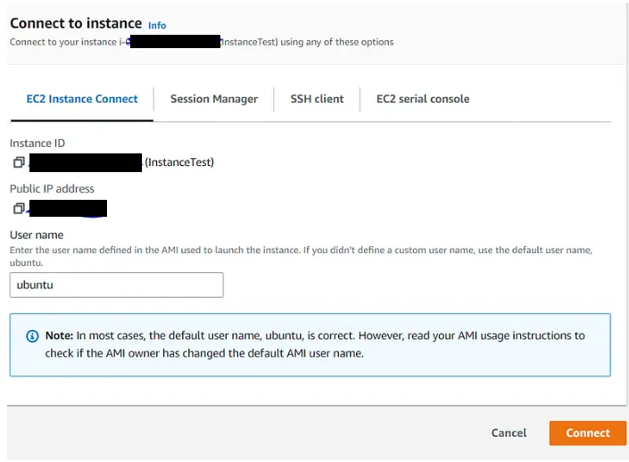

# Install Cassandra 4.1 on Ubuntu Server 22.04 EC2 AWS
This repository contains the steps and code I used to install Apache Cassandra on an Ubuntu EC2 instance in AWS. The instructions include setting up the server, configuring Cassandra, and running the necessary commands.

## Requirenment 📃
- Aws account
- Ec2 instance:
- - Ubuntu 22.04
- - Instance type: t2.medium / t2.small /t3.medium

## Steps 👣
- Connect to the instance 🔌
- Install Cassandra 4.1 ⛏️
- Create user y password 👥
- Add ip in the security groups 🔐

1 - Connection type: SSH 🔌 <br>

2 - Install Cassandra 4.1 ⛏️
```
run commands:
Reload local package
sudo apt-get update

# Java install and java version
sudo apt-get install openjdk-8-jdk
java --version

# Add key
curl https://downloads.apache.org/cassandra/KEYS | sudo apt-key add -

# Cassandra 4.1 or 3.11
echo "deb https://debian.cassandra.apache.org 41x main" | sudo tee -a /etc/apt/sources.list.d/cassandra.sources.list
# echo "deb https://debian.cassandra.apache.org 311x main" | sudo tee -a /etc/apt/sources.list.d/cassandra.sources.list

# Reload local package and Cassandra install
sudo apt-get update -y

# Cassandra Install
sudo apt-get install cassandra -y

# Cassandra stop
sudo systemctl stop cassandra

# Cassandra restart
sudo systemctl restart cassandra

# Cassandra start
sudo systemctl start cassandra

# Cassandra status
sudo systemctl status cassandra
```

2.a Modify etc/cassandra/cassandra-env.sh:
```
sudo vim /etc/cassandra/cassandra-env.sh
JVM_OPTS="$JVM_OPTS -Djava.rmi.server.hostname=PublicIpEc2Instance"
```

2.b Cassandra restart
```
sudo systemctl restart cassandra
```

2.c Modify etc/cassandra/cassandra.yaml:
```
sudo vim /etc/cassandra/cassandra.yaml

#comment // listen_address - <Private_ip>
broadcast_address - <Public_DNS>
broadcast_rpc_address - <Public_DNS>
seeds in seed_providers - <Public_DNS>
rcp_address - 0.0.0.0

# Cassandra restart
sudo systemctl restart cassandra

# Cassandra status
sudo systemctl status cassandra
```

3. Create user y password in Cassandra 👥
```
# In /etc/cassandra/cassandra.yaml file. Replace AllowAllAuthenticator by PasswordAuthenticator
sudo vim /etc/cassandra/cassandra.yaml

# Cassandra restart
sudo service cassandra restart

# Nodetool status
sudo nodetool status

# Login in cqlsh
cqlsh -u cassandra -p cassandra

# Create new user and password
CREATE ROLE userReplace WITH PASSWORD='passwordReplace' AND LOGIN=true AND SUPERUSER=true;
```

4. Add IPs in the security group on Aws 🔐
<br>
Add the Ec2 instance public IP in the security group of the EC2.<br>
If you want to use your local, add your IP:<br>
Protocol: TCP<br>
Port: 9042<br>
The installation is complete and Cassandra is ready to use 🚀<br>

